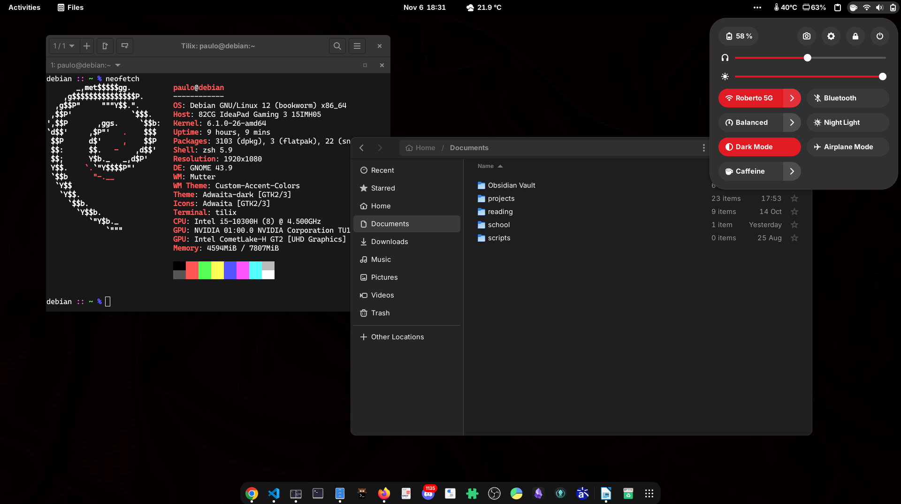

## My Debian 12 setup configuration

## GNOME Shell Extensions

- [Grand Theft Focus](https://extensions.gnome.org/extension/5410/grand-theft-focus/)
- [Caffeine](https://extensions.gnome.org/extension/517/caffeine/)
- [Clipboard Indicator](https://extensions.gnome.org/extension/779/clipboard-indicator/)
- [Custom Accent Colors](https://extensions.gnome.org/extension/5547/custom-accent-colors/)
- [Dash to Dock](https://extensions.gnome.org/extension/307/dash-to-dock/)
- [Gnome 4x UI Improvements](https://extensions.gnome.org/extension/4158/gnome-40-ui-improvements/)
- [OpenWeather](https://extensions.gnome.org/extension/750/openweather/)
- [Tray Icons: Reloaded](https://extensions.gnome.org/extension/2890/tray-icons-reloaded/)
- [Vitals](https://github.com/corecoding/Vitals)
- [Just Perfection](https://extensions.gnome.org/extension/3843/just-perfection/)

## Zsh config

Requirements
- [oh my zsh framework](https://github.com/ohmyzsh/ohmyzsh) 
- [zsh autosuggestions plugin](https://github.com/zsh-users/zsh-autosuggestions)

My config
- [my .zshrc](./zsh/.zshrc)

## Cursor

- [macOS Cursor](https://www.gnome-look.org/p/1408466/)

## Fonts 

- [Inter Font](./fonts/Inter.ttc) -> GNOME UI
- [CaskaydiaCoveNerdFont-Regular](./fonts/CaskaydiaCoveNerdFont-Regular.ttf) -> terminal and vscode

## Wallpaper

- [Full black wallpaper](./wallpapers/wallpaper-2.jpg)

